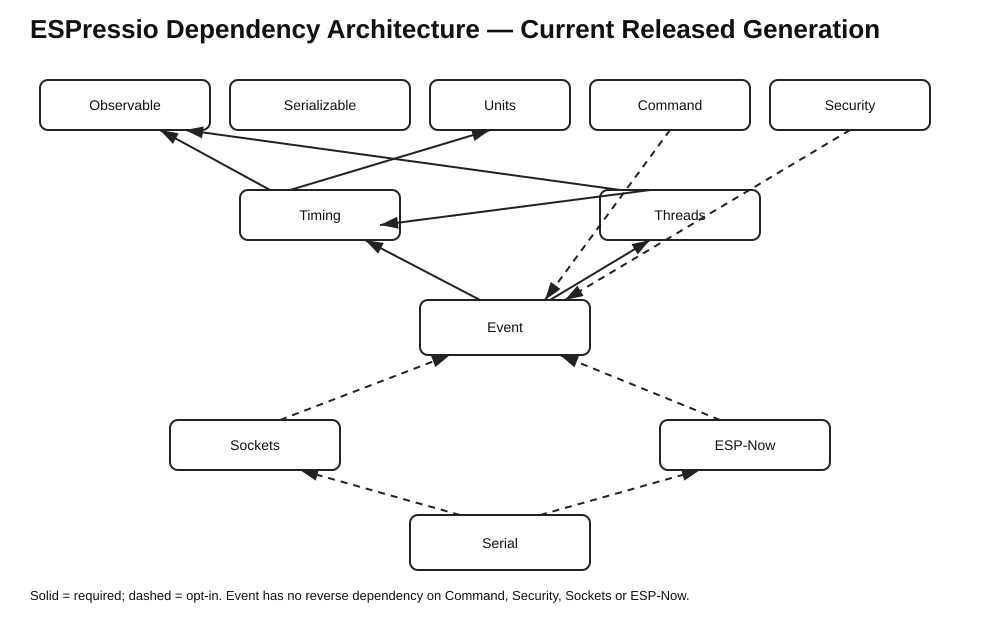

# ESPressio Dependency Chart — Current Released Generation



This document is the canonical snapshot of the current released ESPressio dependency generation. Arrows point from the consuming library to the library it consumes.

- **Required** — the dependency is part of the library's normal/core contract.
- **Opt-in** — the dependency is introduced only when the corresponding integration/header is selected.

## Released generation

```text
Observable
Serializable
Units
Timing
Threads
Event
Command
Security
Sockets
ESP-Now
Serial
```

## Required dependencies

```text
Observable
    -> none

Serializable
    -> none

Units
    -> none

Timing
    -> Units main
    -> Observable main

Threads
    -> Timing main
    -> Observable main

Event
    -> Threads main
    -> Timing main
    -> Observable main

Command
    -> Observable main

Security
    -> Observable main

Sockets
    -> Observable main

ESP-Now
    -> Timing main
    -> Observable main

Serial
    -> none in the core package
```

## Opt-in integrations

```text
Units
    - - -> Serializable main
            Serializable Unit variants

Event
    - - -> Serializable main
            Serializable Events / Event Transport

Command
    - - -> Event main
            Command-owned Event types / CommandRegistryEventBridge

Security
    - - -> Event main
            Security-owned Event types / TransportSecurityEventBridge

Sockets
    - - -> Event main
    - - -> Command main
    - - -> Security main
    - - -> Timing main

ESP-Now
    - - -> Event main
    - - -> Command main
    - - -> Security main

Serial
    - - -> Command main
    - - -> Security main
    - - -> Sockets main
    - - -> ESP-Now main
    - - -> Event main
    - - -> Serializable main
    - - -> Timing main
    - - -> Threads main
```

`JsonCommandInterpreter` optionally consumes external **ArduinoJson 7.x**. ArduinoJson is not an ESPressio library and is therefore not represented as an ESPressio graph edge.

## Dependency-direction invariants

Event owns the generic Event mechanism. Domain-specific Event types and bridges belong to the lowest-order library that owns the represented concept without introducing a reverse dependency:

```text
Command  - - -> Event
Security - - -> Event
Sockets  - - -> Event
ESP-Now  - - -> Event

Event -> Command   NONE
Event -> Security  NONE
Event -> Sockets   NONE
Event -> ESP-Now   NONE
```

Timing and Threads Event bridges remain in Event because Event already requires Timing and Threads for its own responsibilities; moving those bridges upstream would create reverse dependencies.

Serial remains terminal/downstream. No upstream ESPressio library should depend on Serial.

## Standalone repositories

ESPressio Tree and ESPressio WiFi are not dependency edges in the coordinated graph above. Tree is a standalone generic component. WiFi currently has no implemented public API and must not be treated as a dependency of the released stack merely because legacy package metadata exists in its repository.
