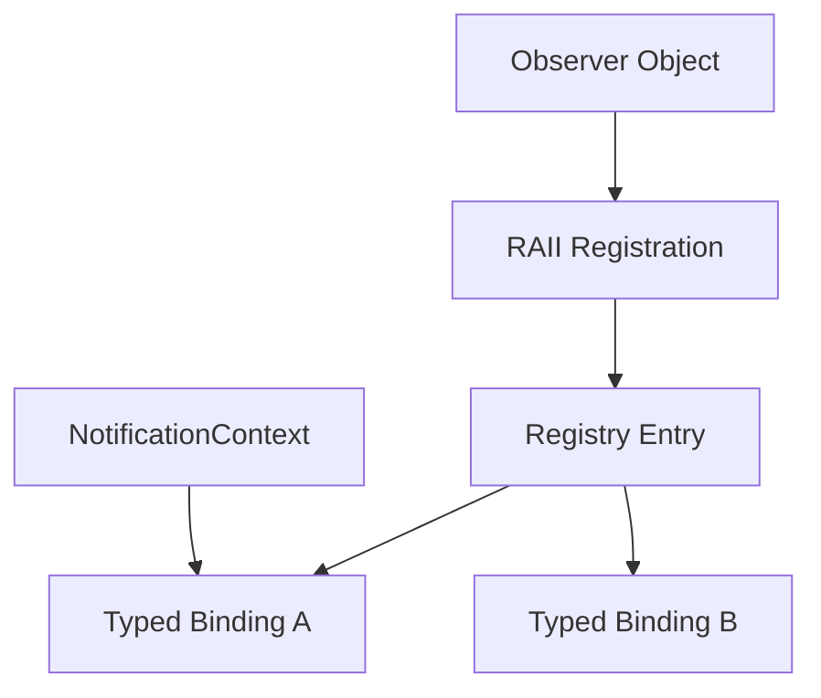

# Extension Architecture

Observable's core abstraction is a synchronous registry of non-owning observer objects plus typed interface bindings established at registration time.

## Extension invariants

Preserve:

- synchronous notification semantics;
- non-owning observer lifetime;
- RAII registration ownership;
- typed registration-time binding;
- no RTTI requirement;
- safe mutation during notification;
- equivalent typed behaviour between `Observable` and `ThreadSafeObservable`.

## Scope

Observable should not acquire queues, schedulers, task creation, transport logic, or Event dependencies. Those concerns belong to asynchronous/higher-level libraries.

## Memory

Registration/binding storage should continue to use ESPressio System memory abstractions rather than platform-specific allocation APIs.