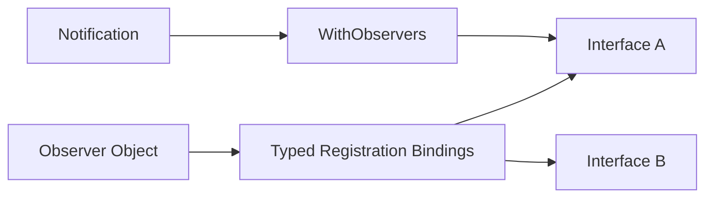

# ESPressio Observable

> Documentation baseline: **1.0.0**

ESPressio Observable provides synchronous, typed Observer Pattern infrastructure for the ESPressio Development Platform.

Use Observable when a producer must notify one or more independent consumers **during the same operation**. Observable does not introduce a queue, worker, scheduler, or asynchronous boundary.

## Choose your documentation path

### Using the library

- [Getting Started](Getting-Started)
- [Typed Observer Interfaces](Typed-Observer-Interfaces)
- [Registration and Lifetime](Registration-and-Lifetime)
- [Executing Notifications](Executing-Notifications)
- [Multiple Observer Interfaces](Multiple-Observer-Interfaces)
- [Untyped Observation](Untyped-Observation)
- [Thread Safe Observable](Thread-Safe-Observable)
- [Memory Behaviour](Memory-Behaviour)
- [Observable versus Event](Observable-versus-Event)

### Extending the library

- [Extension Architecture](Extension-Architecture)
- [RTTI Free Dispatch](RTTI-Free-Dispatch)
- [Registration Registry Contract](Registration-Registry-Contract)
- [Notification Reentrancy and Mutation](Notification-Reentrancy-and-Mutation)
- [Adding Observer Interfaces](Adding-Observer-Interfaces)
- [Testing Observable Extensions](Testing-Observable-Extensions)

## Dispatch model

Typed bindings are established at registration time. Notification does not use `dynamic_cast` or C++ RTTI.

## Dependency

Observable depends on ESPressio System for allocator-aware registration/binding storage. It does not depend on ESPressio Event.